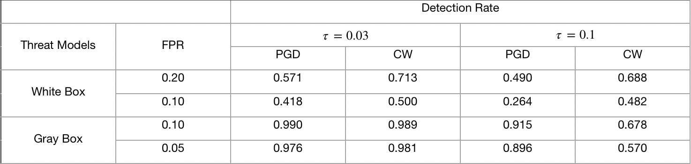

## A New Defense Against Adversarial Images: Turning a Weakness into a Strength


#### Authors:
* [Tao Yu](http://www.cs.cornell.edu/~tyu/)*
* [Shengyuan Hu](https://s-huu.github.io)*
* [Chuan Guo](https://sites.google.com/view/chuanguo)
* [Weilun Chao](http://www-scf.usc.edu/~weilunc/)
* [Kilian Q. Weinberger](http://kilian.cs.cornell.edu/index.html)

*: Equal Contribution

### Introduction
This repo contains official code and models for the NeurIPS 2019 paper, [A New Defense Against Adversarial Images:
Turning a Weakness into a Strength](https://arxiv.org/abs/1910.07629).

We postulate that if an image has been tampered with adversarial perturbation, then surrouding adversarial directions
either become harder to find with gradient methods or have substantially higher density than for natural images.
Based on this, we develop a practical test for this signature characteristic to successfully detect both gray-box and
white-box adversarial attacks. Here are the experiment results on ImageNet against different attacks:



### Dependencies
* Python 3
* PyTorch >= 1.0.0
* numpy

### Data
- For CIFAR10 dataset, it is downloaded automatically by torchvision.datasets.CIFAR10 function in train_vgg19.py.
- For ImageNet dataset, download the validation images to a folder `./imagenetdata/`, then move them into labeled subfolders with
imagenet.sh.

### Usage
train_vgg19.py is adopted from [pytorch-vgg-cifar10](https://github.com/chengyangfu/pytorch-vgg-cifar10) with an modification of
adding BatchNormalizations to the model. To train a vgg19 model for CIFAR10, run:
```
$ python train_vgg19.py
```
To perform an attack, run:
```
$ python attack.py [-h] --real_dir REAL_DIR --adv_dir ADV_DIR --name NAME
                   [--dataset DATASET] [--setting SETTING] [--allstep STEP]
                   [--base BASE] [--lowbd LOWBD] [--upbd UPBD] [--radius RADIUS]
optional arguments:
  -h, --help            show this help message and exit
  --real_dir REAL_DIR   directory to store images correctly classified
  --adv_dir ADV_DIR     directory to store adversarial images
  --name NAME           the name of the adversarial example
  --dataset DATASET     cifar | imagenet
  --setting SETTING     white | gray
  --allstep STEP        number of steps to run an iterative attack
  --base BASE           model: vgg for cifar and resnet/inception for imagenet
  --lowbd LOWBD         index of the first adversarial example to load
  --upbd UPBD           index of the last adversarial example to load
  --radius RADIUS       adversarial radius
```
To evaluate the detection method, run:
```
$ python evaluate.py [-h] --real_dir REAL_DIR --adv_dir ADV_DIR --title TITLE
                     [--dataset DATASET] [--base BASE] [--lowbd LOWBD] 
                     [--upbd UPBD] [--fpr FPR] [--det_opt OPT]
optional arguments:
  -h, --help            show this help message and exit
  --real_dir REAL_DIR   directory to store images correctly classified
  --adv_dir ADV_DIR     directory to store adversarial images
  --title TITLE         name/title of your attack
  --dataset DATASET     cifar | imagenet
  --base BASE           model: vgg for cifar and resnet/inception for imagenet
  --lowbd LOWBD         index of the first adversarial example to load
  --upbd UPBD           index of the last adversarial example to load
  --fpr FPR             false positive rate for detection
  --det_opt OPT         combined | l1 | targeted | untargeted
```

### Citation
If you use our code or wish to refer to our results, please use the following BibTex entry:
```
@InProceedings{Yu_2019_NeurIPSweakness,
  author = {Yu, Tao and Hu, Shengyuan and Guo, Chuan and Chao, Weilun and Weinberger, Kilian},
  title = {A New Defense Against Adversarial Images: Turning a Weakness into a Strength},
  booktitle = {Proceedings of the 33rd Conference on Neural Information Processing Systems (NeurIPS 2019)},
  month = {Oct.},
  year = {2019}
}
```
