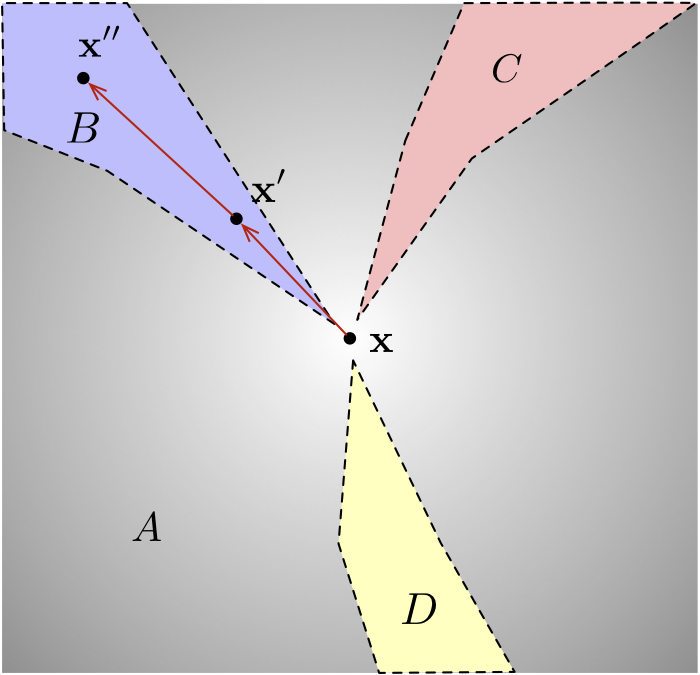

# A New Defense Against Adversarial Images: Turning a Weakness into a Strength

Code and models for the paper A New Defense Against Adversarial Images: Turning a Weakness into a Strength, NeurIPS2019.

## Introduction

<div align="center">
  
</div>

by..


## Citation

If you use our code, models or wish to refer to our results, please use the following BibTex entry:
```
@InProceedings{Yu_2019_NIPS,
  author = {Tao Yu, Shengyuan Hu, Chuan Guo, Weilun Chao and Kilian Q. Weinberger},
  title = {A New Defense Against Adversarial Images: Turning a Weakness into a Strength},
  booktitle = {The 33rd Conference on Neural Information Processing Systems (NeurIPS 2019)},
  month = {Oct.},
  year = {2019}
}
```